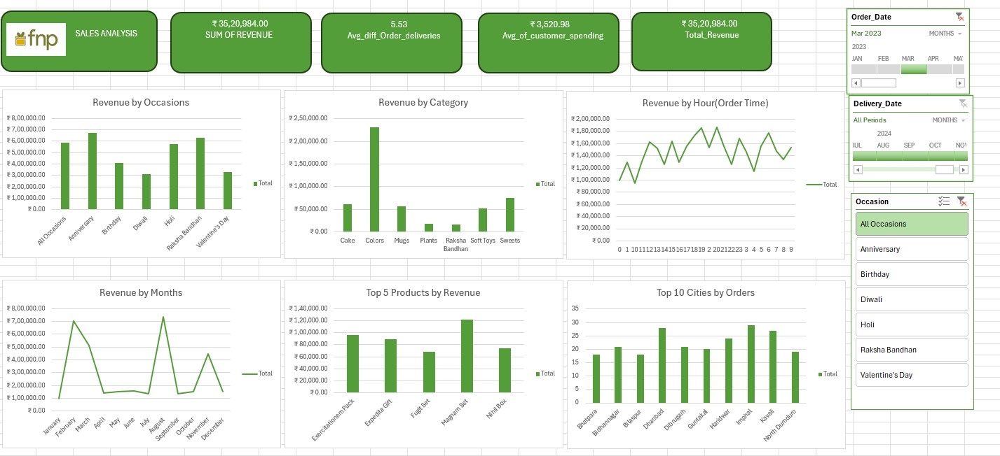

# 📊 **Executive Summary – FNP Sales Analysis Dashboard**

This project presents an interactive **Excel dashboard** that analyzes sales performance for **Ferns N Petals (FNP)**.  
The dashboard provides a clear overview of **revenue, customer behavior, seasonal trends, and top-performing products/cities**, enabling **data-driven business decisions**.

## 🎯 **Project Objective**

To analyze FNP sales data and uncover insights on:

- Customer spending patterns  
- Seasonal and occasion-based revenue drivers  
- Product category performance  
- Regional market opportunities  
- Growth trends over time  

The dashboard was built using **Excel PivotTables, PivotCharts, Slicers, and GETPIVOTDATA** for interactivity and automation.

## 🔑 **Key Insights**

### 💰 **Revenue Performance**
- **Total revenue**: ₹35,20,984  
- **Average customer spending**: ₹3,520.98  
- **Average order delivery difference**: 5.53 days  

### 🎉 **Occasion-based Sales**
- Highest revenue from **Anniversary** and **Raksha Bandhan**  
- **Diwali** and **Holi** also drive significant seasonal sales  

### 📦 **Category Insights**
- **Colors** contribute the highest revenue among categories  
- Other strong performers: **Cake, Mugs, Sweets**  

### 🏆 **Top Products**
- Exercitationem Pack  
- Expeditia Gift  
- Fugae Set  
- Magnam Set  
- Nihil Box  

### 🌍 **Regional Insights**
- **Delhi, Jaipur, and Pune** are top-performing customer bases  
- High order volumes + strong sales → **best candidates for store expansion**  

### ⏰ **Time Trends**
- Monthly spikes in **February, August, and October** (festivals/occasions)  
- **Evening hours** show consistent peak order times  

## 🛠 **Tools & Techniques**

- **Excel** → PivotTables, PivotCharts, Slicers, Timeline filters  
- **Data Cleaning** → Ensured consistency of sales, product, and date fields  
- **Formulas Used** → GETPIVOTDATA, SUMIFS, calculated KPIs  
- **Visualization** → Interactive charts for category, occasion, time, and regional analysis  

## 📌 **Business Recommendations**

Based on insights, the **top three recommended cities for new store openings** are:

🏆 **Pune** → Highest total revenue, strong customer spending, and low rent per customer.  
🏆 **Delhi** → Largest customer base (~68), high consumer base, reasonable rent.  
🏆 **Jaipur** → High customer count (69), strong average sales, very low rent per customer.  

## 📷 **Dashboard Preview**

Here’s a snapshot of the FNP Sales Analysis Dashboard:  

## 👩‍💻 **Author**

**Manasa Pelluru**  
Graduate Student | Software Engineering & Data Analytics  
Passionate about **Data Analysis, Cloud Technologies, and Business Intelligence**  

✨ *This project demonstrates how data analytics with Excel can translate raw sales data into actionable insights for strategic decision-making.*

