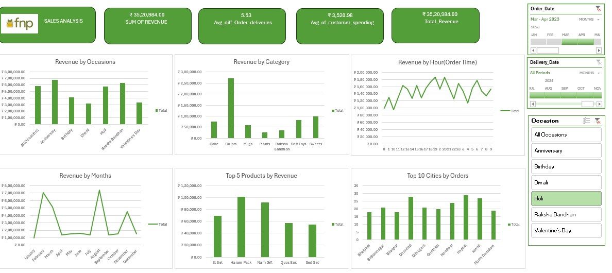

# 📊 FNP Sales Analysis Dashboard

This project presents an interactive **Sales Analysis Dashboard** built in **Excel** for **Ferns N Petals (FNP)**.  
The dashboard provides a clear overview of revenue, customer behavior, seasonal trends, and top-performing products/cities, enabling **data-driven business decisions**.

## 🚀 Project Overview

The main goal of this project is to analyze FNP’s sales data and uncover actionable insights such as:

- Customer spending patterns  
- Seasonal and festival-based trends  
- High-performing products and categories  
- Top cities contributing to sales  
- Revenue distribution by time of day  

## 🖼️ Dashboard Preview  

## 📌 Key Insights

### 🔹 Top Metrics
- **Total Revenue:** ₹ 35,20,984  
- **Average Order Delivery Difference:** 5.53 days  
- **Average Customer Spending:** ₹ 3,520.98  

### 🔹 Revenue Breakdown
- **By Occasion:** Highest sales during **Anniversaries, Diwali, and Holi**  
- **By Category:** **Colors, Cakes, and Sweets** dominate sales  
- **By Month:** Peaks in **March** and **September**  
- **By Hour:** Strong order activity between **12 PM – 9 PM**  

### 🔹 Top Products
- **E Set** and **Hamper Pack** lead product-wise revenue  

### 🔹 Top Cities
- High order volumes from **Delhi, Mumbai, Hyderabad, and Kolkata**  

## ⚙️ Tools & Technologies Used
- **Microsoft Excel** (Pivot Tables, Charts, Slicers, Interactive Filters)  
- **Data Cleaning & Preparation** in Excel  
- **Visualization Techniques** for trends and insights  

## 📂 Project Files
- `FNP_Sales_Dashboard.xlsx` → Interactive dashboard file  
- `FNP_Sales_Report.docx` → Supporting documentation (if any)  
- `README.md` → Project description  

## 💡 Future Enhancements
- Automating data refresh using **Power Query**  
- Exporting the dashboard to **Power BI** for more advanced interactivity  
- Adding **predictive analytics** for sales forecasting  

## 👩‍💻 Author
Developed by **Manasa Reddy**  
Graduate Student in **Computer Science – Software Engineering & Data Analytics**  

